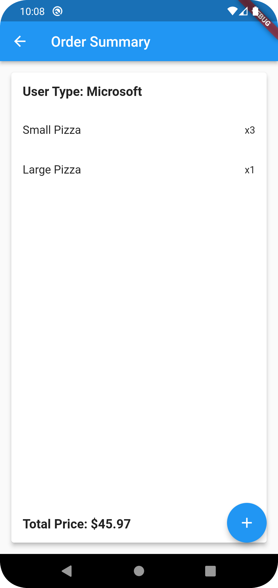

# FlutterProductCheckoutApp


Checkout App is a simple Flutter application that allows users to order pizzas with various pricing rules based on their user type.

## Features

- Choose a user type (Microsoft, Amazon, Facebook, etc.).
- Select the quantity of pizzas (Small, Medium, Large).
- Apply pricing rules based on the user type.
- Calculate the total cost of your order.
- View the order summary.

## Screenshots

<!-- Add screenshots of your app here -->

### Home Screen


### Order Summary


## Installation

To run this app on your local machine, follow these steps:

1. Clone this repository:

   ```bash
   git clone https://github.com/Bavarna/FlutterProductCheckoutApp.git
2. cd pizza-checkout-app
3. Install dependencies: flutter pub get
4. Run the app: flutter run


